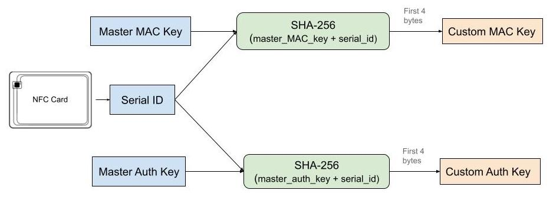

## Network security Project 1: NFC Ticket
  
---  

####<center>By "Alessandro Chiarelli (1012084)" and "Bipin Khatiwada (1011292)"</center>
  
---  

### Summary
[1. Design Decision & Features](#design-decision--features) <br>
[2. Memory design](#memory-design) <br>
[3. Key Diversification](#key-diversification) <br>
[4. Threat analysis](#threat-analysis) <br>
[5. Issuing tickets](#issuing-tickets) <br>
[6. Validating tickets](#validating-tickets) <br>

 ---  
### Design Decision & Features
- Unique key for each card, generated using the Serial ID of the card and master secret, that is different that the default password of the card.
- Unique key for MAC generation.
- 2 MACs to validate the integrity of the data in the card: one for static data and other for dynamic data.
- Read and Write protected in all the user memory pages used by the application.
- Multiple taps within 5 seconds *(configurable)* are blocked.
- 3 tickets *(configurable)* are issued in each issue action.
- More than 50 tickets *(configurable)* are not allowed to issue for any card.
- 30 days validity *(configurable)*, are given from the date of first use, while issuing tickets.
- More than 90 days *(configurable)* of validity period is not given to any card, regardless the number of tickets issued.
- If the card has non-expired tickets, those tickets are added during the new issue.
- If the card has non-expired tickets, the validity duration is added on top of the previous value.

---  

### Memory design

The NFC card that we use is organised in pages, each of 4 bytes long. In order to easily read and write in a continuous pages, we are using memory pages from page 31 to 41. Page 31 to 39 is a part of user memory, while page 40 is for lock bits and 41 is for internal counter of the card. All the other pages are not use by our proposed solution so they are either empty or filled with the default values.

Here we outline the purpose of each page in the memory that are used by our application:

| Page Number | Page Number (Hex) | Data contained | Remarks |  
|:----------:|:-------------:|:------:|:------|  
| 0, 1 | 00, 01 | Serial ID | *default card memory* / Serial unique ID of the card. |  
| 31 | 1F | App Tag | Identifier to check the card belongs to our app.|  
| 32 | 20 | App Version | App version that was used to format the card (if it is). |  
| 33 | 21 | Counter State | Value of internal counter when tickets were issued. |  
| 34 | 22 | Ticket Count | Number of tickets issued. |  
| 35 | 23 | Valid For | Number of days for which tickets are valid for from the "first use" day. |  
| 36 | 24 | Static Data MAC | First 4 bytes of the MAC of all data from page 31 to 35. |  
| 37 | 25 | First Use | UNIX timestamp to store the date when the card was first used. |  
| 38 | 26 | Last Use | UNIX timestamp to store the date when the card was last used. This is used to check & invalidate two successive taps within short time. |  
| 39 | 27 | Dynamic Data MAC | First 4 bytes of the MAC of page 37. |  
| 40 | 28 | Lock Byte Configuration | *default implementation of card* |  
| 41 | 29 | Internal Counter | *default card memory* / A oneway incrementing counter. |  
| 42, 43 | 2A, 2B | Auth Configuration | *default card memory* / Set read/write protection in several pages. |  
| 44 - 48 | 2C - 30 | Authentication Key | *default card memory* / Key for authentication. |  
  
---  

### Key Diversification


  
---  

### Threat analysis


#### Data
All the data needed for validating the ticket and authenticity is present in the card itself. The advantage of this is that we don't need any online server to request any more data.

--
#### Authentication
We overwrite the default key with our own master key. Using the Key diversification as shown in the figure above, each card will have unique shared secret key. Master keys, stored in the reader, combined with the unique serial ID of the card will always (with very high probability) generate unique shared secret key that'll be used for authentication and MAC generation.  So, the advantages are:
- Snce default key is overwritten, there's no possibility of using attack with default card key.
- Cloning is prevented because attacker would have to know the shared key first.

--

#### Key leakage
Since we read the card ID and calculate the shared key using master key on the reader device,
- The master key would never leave the reader device and not be used/sent directly in any communication.
-  Even if the attacker compromises the authentication or mac key of one card, they would not be able to compromise other cards because each shared key would be different.

--

#### Read/Write of the memory pages
AUTH1 and AUTH2 parameters are set such that all the memory pages used in this project (page 31 to 39) are **read-write protected**. So, without knowing shared key, only serial ID of the card can be known, which is not sufficient to perform any attack.

--

#### Logging and Transaction logs in the card
We experimented storing logs of past 5 transactions in the card itself, but that increased number of WRITE commands during each validation. Although only one WRITE command could have been used to store latest log by replacing oldest log, we removed it from storing in card to prevent tearing. So, now, the logging of the event is done only in the reader side and no logs are stored in the card. This can further be properly managed using online server to store log, or exporting logs in a separate file. While doing this, we can elimiinate to include any personal user data and delete it in regular interval in compliance with GDPR or any other privacy regulation.

--

#### App Tag and App Version
Right after authentication is successful, we check the application tag stored in page 31 and application version in page 32.
If the application tag matches, it means the card may be ours and is for the ticket use case that we designed it for. So, we can proceed further. Else, the card might be ours (since we were able to authenticate it) or the card is brand new, but not beign used for this particular ticketing use case.
By checking the application version, we can handle the change in application updates, flow of data read/write, identify the data structure present in the card and proceed further. With this, any update or change in the application side won't invalidate the previously issued cards. In short, it enables **backward compatibility** .

--

#### Formatting the new card
If the card can be authenticated with the default manufacture key, we make sure the counter is at least 1000 less than its max value and the pages we use are not locked. Then, we format the card.

--

#### MitM attack between reader and card
Assuming that the attacker somehow mounted special hardware to perform MitM attack between reader and the card itself, we never share the master key in between the card and the reader. Also, we write the shared key to the card only during formatting and it is then never sent in the communication messages anytime later. However, it is due to the fact that Ultralight C does not have secure session protocol, attacker can still spoof or launch attack after the first authentication is complete. So, the security depends on the security of the reader's machine.

--

#### Data Integrity
For all the information stored in the card (app tag, app version, counter state, ticket count, valid time), we generate a MAC using generated MAC key that is unique to each card. We call this **static mac** because the information is <u>stored only once</u> during issue and never changes during validation. Any changes in those values would be detected using MAC checks.
Attacker cannot reuse the MAC value because The key used for MAC is obtained using the key diversification, which further depends on the  master key and the card UID. Since each card has different UID, MAC generated for same message will not match in 2 different cards.

For the dynamic data that changes during validation (eg: first use) we generate a separate **dynamic mac** and store. This MAC generation happens <u>only once</u> during the first validation and never repeated unless new tickets are issued and first use date has to be cleared.

--

#### Rollback Attack Prevention
The counter of the card is one way monotonic counter which cannot be roll back. Even if the attacker copies the old data and old mac to the card, due to the fact that we check the remaining count as the difference between current counter value and the counter state that was set during the issue, the rollback action won't be able to generate new tickets.

--

#### Tearing
To prevent/minimize the tearing, the ticket validation process has minimum possible WRITE count. There are
- 3 WRITEs during first validation (1 for storing <u>first use</u>, 1 for storing <u>dynamic mac</u>, 1 for increasing <u>counter</u>)
- 1 WRITE in any subsequent validations (only to increase the <u>counter</u>)

After each validation, we have also added an extra WRITE command during validation to store the last use date. However, even if this last WRITE command fails, it won't affect the app functionality and will have no effect on security. The purpose of last use date is to prevent two successive validations within 5 seconds interval. In case, the last use is failed to write due to tearing, worst that can happen is the 2nd validation is allowed within 5 seconds.

--

#### Idempotent operations
We forbid the two successive validations within 5 seconds using the last use field in the card. In real world, the interval can be increased from 5 seconds to 1 minute depending on the use case. However, this can be modified if we are to allow second validation without any reduction in the ticket count as well. This modification however can allow pass-back fraud. So, as a design choice we opted to forbid ticket validation within 5 seconds.

--

#### Pass-back protection
Our app forbids to validate the same ticket twice within 5 seconds providing a level of security for pass-back. This interval is configurable to increase the interval. SImilarlu, this pass-back operation can also be prevented by checking the usage logs in the reader side to see recent validations. However, this is not implemented in our implementation.

--

#### Signalling success
Only after we complete all the necessary WRITE commands in our application, we show the SUCCESS message. This makes user to tap the card for sufficient time without tearing it between the transactions.

--

#### Safe limits
- No more than 50 tickets are allowed in a single ticket at a time, no matter how many times it is issued.
- No more than 90 days of validity is allowed in a single ticket at a time, no matter the ticket count and time of issue.
  Both of these values are configurable.

--

#### Transaction Speed
- The transaction speed depends on the processing power of the reader and strength of the NFC chip used in the communication. For our use cases, we are able to do issue within 300 ms and validation within 100 ms using Oneplus 6 and Nokia 8.

---  

### Issuing tickets
In order to issue tickets and/or format new cards, we use the `issue() ` function available in the file `/app/src/main/java/com/ticketapp/auth/ticket/Ticket.java` .

#### Algorithm
 ```` 
 1. Read Serial ID of card. If fails, abort. 
 2. Calculate diversified key for authentication and MAC. 
 3. Authenticate the card. If fails, abort. 
 4. Read byte array from page 31 to 41. Parse all byte array to readable form. 
 5. Check if app tag is present to verify this is our card 
    5.1. If App tag is present: 
        5.1.1. issueNewTicket = False 
        5.1.2. Validate if App tag matches. If fails, abort. 
        5.1.3. Validate if App version matches. If fails, abort. 
        5.1.4. Check if the static MAC matches. If fails, abort. 
    5.2. If App tag is not present: 5.2.1. issueNewTicket = True 
        5.2.2. Format the card with app tag and version.
 6.   
    6.1. if issueNewTicket = False,  
        6.1.1. Add the remaining non-expired tickets plus new ticket count.         
        6.1.2. Ensure total ticket count is no more than 50.  
        6.1.3. Add the validity period of new tickets plus the previous validity period.         
        6.1.4. Ensure total validity period is no more than 90 days.  
    6.2. Else, 6.2.1. Add App Tag and App version if missing. 
        6.2.2. Add counter value to counter state memory. 
        6.2.3. Add new tickets to issue. 
        6.2.4. Add new validity period.
 7. Issue tickets  
        7.1. Calculate static MAC and add its first 4 bytes. 
        7.2. Set first use period to null. 
        7.3. Calculate dynamic MAC and add its first 4 bytes. 
        7.4. Write changed pages to the NFC card.
 8. return  
````


---  

### Validating tickets

In order to issue tickets and/or format new cards, we use the `use() ` function available in the file `/app/src/main/java/com/ticketapp/auth/ticket/Ticket.java` .

##### Algorithm

````  
 1. Read Serial ID of card. If fails, abort. 
 2. Calculate diversified key for authentication and MAC. 
 3. Authenticate the card. If fails, abort. 
 4. Read byte array from page 31 to 41. If fails, abort. 
      4.1. Parse all byte array to readable form. 
 5. Validate app tag and app version. If either fails, abort. 
 6. Validate static data MAC 
 7. Check if there are remaining tickets. If no, abort. 
 8. Check the first use 
      8.1. If counter = counterState, // first validation 
          8.1.1. Set firstUse to now 
          8.1.2. Calculate dynamic MAC, and store its first 4 bytes. 
          8.1.3. Write first use date and dynamic MAC to card. 
          8.1.4. Increase the counter by 1. 
      8.2. Else, 
          8.2.1. Check if this validate is called within 5 seconds of last use. If yes, abort. 
          8.2.2. Validate dynamic data MAC 
          8.2.3. Check if tickets are expired. If yes, abort. 
          8.2.4. Increase the counter by 1.
 9. Set last use to now and write to the card.  
10.return 
````